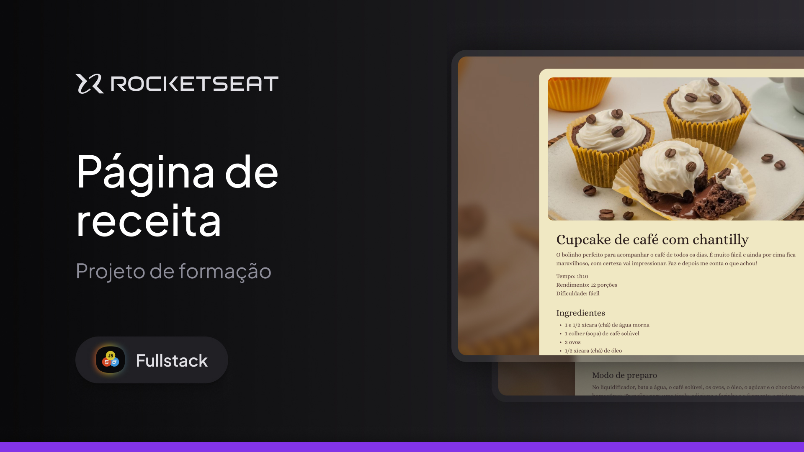

# 🍽️ Página de Receita

Projeto desenvolvido durante meus estudos na **Rocketseat**, onde construí uma **Página de Receita** utilizando HTML, CSS e JavaScript. O objetivo foi praticar a estruturação de páginas web, estilização e interatividade.



## 🚀 Tecnologias Utilizadas

- HTML5
- CSS3

## 📌 Funcionalidades

✅ Estruturação semântica da página 
✅ Estilização moderna e responsiva 
✅ Interatividade para exibição de ingredientes e modo de preparo 
✅ Design simples e intuitivo

## 🎨 Layout

O design foi baseado nas diretrizes apresentadas durante o curso da **Rocketseat**. 

## 📂 Como Executar o Projeto

1. Clone o repositório:
```bash
  git clone https://github.com/gustavopmb/projeto-fullstack-receita.git
```
2. Acesse a pasta do projeto:
```bash
  cd projeto-fullstack-receita
```
3. Abra o arquivo `index.html` no navegador.

## 📜 Licença

Este projeto foi desenvolvido para fins educacionais e está sob a licença MIT.

---

Feito com 💜 por Gustavopmb 🚀
